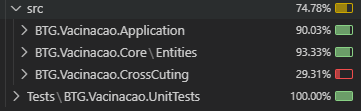

# 💉 API - Cartão de Vacinação (Desafio Técnico BTG)

Sistema completo para gerenciamento de vacinação, com autenticação JWT, validação robusta de dados e arquitetura escalável.

---

## 📌 Funcionalidades

A API cobre todos os requisitos do desafio técnico proposto pelo BTG, com foco em segurança, validações e organização de código:

- ✅ Cadastro de Pessoa
- ✅ Cadastro de Vacina
- ✅ Registro de Vacinação
- ✅ Consulta de Cartão de Vacinação por CPF
- ✅ Exclusão de Pessoa e de Vacinação
- ✅ Listagem de Pessoas e Vacinas
- ✅ Autenticação com JWT
- ✅ Middleware global de tratamento de exceções
- ✅ Validação de CPF com verificação de dígitos
- ✅ Testes Unitários

---

## ⚙️ Tecnologias Utilizadas

**Backend**
- ASP.NET Core 8
- MediatR
- Entity Framework Core (com SQLite)

**Validação e Segurança**
- FluentValidation
- JWT (Json Web Token)
- Bcrypt

**Documentação e Testes**
- Swagger/OpenAPI
- xUnit + Moq

**Arquitetura**
- Clean Architecture
- Domain-Driven Design (DDD)

---

## 🚀 Como executar o projeto localmente

1. Clone o repositório:

```bash
git clone https://github.com/pe-limma/API-Cartao-de-Vacina.git
cd API-Cartao-de-Vacina
```

2. Instale a CLI do Entity Framework (caso não tenha):

```bash
dotnet tool install --global dotnet-ef
```

3. Restaure os pacotes e crie o banco:

```bash
dotnet restore
dotnet ef database update --project src/BTG.Vacinacao.Infra
```

4. Rode o projeto:

```bash
dotnet run --project src/BTG.Vacinacao.Presentation
```

Acesse: `https://localhost:7295/swagger`

---

## 🔐 Autenticação via JWT

ℹ️ **Usuário de acesso para testes:**  
*Este usuário é apenas para fins de demonstração e testes locais.*

- Usuário: `admin_btg`
- Senha: `Admin@123`

### Fluxo

1. Realize o login via `POST /api/Auth/login`
2. Copie o token JWT retornado
3. Clique em **Authorize** no Swagger
4. Insira: `Bearer {seu_token}`

---

## 🎥 Demonstrações Visuais (UX e Fluxo de Uso)

### 🔐 Autenticação
- ✅ **Login com sucesso** – [`01_auth_success.mp4`](docs/videos/01_auth_success.mp4)
- ❌ **Login com falha** – [`02_auth_fail.mp4`](docs/videos/02_auth_fail.mp4)

### 👤 Pessoa

ℹ️ Utilize o site [4Devs - Gerador de CPF](https://www.4devs.com.br/gerador_de_cpf) para gerar CPFs válidos.

- ➕ Cadastro – [`03_person_register.mp4`](docs/videos/03_person_register.mp4)
- 🔍 Listagem – [`04_person_get_all.mp4`](docs/videos/04_person_get_all.mp4)
- 🔎 Consulta por CPF – [`05_person_get.mp4`](docs/videos/05_person_get.mp4)
- 🗑️ Exclusão – [`06_person_delete.mp4`](docs/videos/06_person_delete.mp4)

### 💉 Vacina
- ➕ Cadastro – [`07_vaccine_register.mp4`](docs/videos/07_vaccine_register.mp4)
- 🔎 Consulta por código – [`08_vaccine_get_code.mp4`](docs/videos/08_vaccine_get_code.mp4)
- 🔍 Listagem – [`09_vaccine_get_all.mp4`](docs/videos/09_vaccine_get_all.mp4)

### 💊 Vacinação
- ➕ Registro – [`10_vaccination_register.mp4`](docs/videos/10_vaccination_register.mp4)
- 📋 Cartão por CPF – [`11_vaccination_get_card.mp4`](docs/videos/11_vaccination_get_card.mp4)
- 🗑️ Exclusão – [`12_vaccination_delete.mp4`](docs/videos/12_vaccination_delete.mp4)

### ⚠️ Validações & Erros
- ❗ CPF inválido – [`13_error_invalid_cpf.mp4`](docs/videos/13_error_invalid_cpf.mp4)
- ❗ Pessoa já cadastrada – [`14_error_duplicate_cpf.mp4`](docs/videos/14_error_duplicate_cpf.mp4)
- ❗ Vacina já cadastrada – [`15_error_duplicate_vaccine.mp4`](docs/videos/15_error_duplicate_vaccine.mp4)
- ❗ Vacinação duplicada – [`16_error_duplicate_vaccination.mp4`](docs/videos/16_error_duplicate_vaccination.mp4)

📁 Todos os arquivos estão disponíveis em: `/Docs/Videos/`

---

## 🧪 Testes

- Todos os handlers, comandos e validadores possuem testes unitários.
- Cobertura validada com **Coverlet** no VS Code.



---

## 📂 Estrutura de Pastas

```
src/
  BTG.Vacinacao.Application
  BTG.Vacinacao.Core
  BTG.Vacinacao.CrossCutting
  BTG.Vacinacao.Infra
  BTG.Vacinacao.IoC
  BTG.Vacinacao.Presentation

Tests/
  BTG.Vacinacao.UnitTests

Docs/
  Videos/
```

---

## ✅ Boas Práticas Adotadas

- ✅ **Clean Architecture**: separação clara entre camadas de domínio, aplicação, infraestrutura e apresentação.
- ✅ **DDD (Domain-Driven Design)**: foco no domínio com entidades, agregados e casos de uso bem definidos.
- ✅ **Repository + UnitOfWork Pattern**: abstração do acesso ao banco de forma organizada e desacoplada.
- ✅ **Princípios SOLID**: código modular, testável e de fácil manutenção.
- ✅ **Validações robustas**: mensagens claras e específicas para o consumidor da API.
- ✅ **API RESTful documentada**: Swagger com rotas bem definidas e padronizadas.
- ✅ **Middleware de exceções**: tratamento centralizado para erros com resposta uniforme.

---

## 👨‍💻 Autor

Desenvolvido por **Pedro Lima** – Backend Developer .NET

📫 **Email**: [pedro.lima.wk@gmail.com](mailto:pedro.lima.wk@gmail.com)  
🔗 **LinkedIn**: [linkedin.com/in/pedrolimma20](https://www.linkedin.com/in/pedrolimma20/)